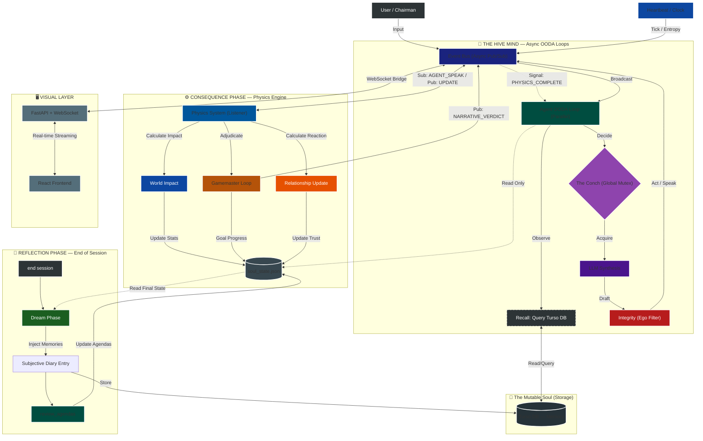

# Project IRON COUNCIL v2.0

**A Psychological Simulation Engine with BDI Architecture, Dynamic Relationships & Subjective Memory.**

> *"Agents are no longer static personas. They hold grudges, form alliances, suffer stress, and refuse to yield."*


---

## 1. System Overview
Iron Council v2.0 is a **real-time, asynchronous, event-driven multi-agent simulation**. Unlike turn-based chatbots, agents operate in parallel execution loops, synchronized by a central heartbeat and a rigorous "Physics Gating" protocol to ensure emotional causality (agents must "feel" an event before they can "react" to it).

The system is built on **FastAPI** (WebSockets) for the frontend bridge and a custom **Python EventBus** for internal agent orchestration.

---

## 2. Core Architecture: The Asynchronous Loop

The system does not run in a linear circle. It runs as independent services communicating via the `EventBus`.




---

## 2.1 Core Principle: Subjective Reality ("The 'I' Shift")

In traditional multi-agent systems, agents read a "God View" transcript (e.g., `Ares: Hello. Dove: Hi.`). This causes "Identity Drift" because the model forgets who it is. 

Iron Council v2.0 implements **Subjective Reality**:
1.  **The Filter:** The Global Event Bus is the "Objective Reality".
2.  **The Shift:** Before an agent perceives an event, the system rewrites the transcript from their perspective.
    *   **Objective:** `General Ares: Attack!`
    *   **Ares Sees:** `YOU: Attack!`
    *   **Dove Sees:** `General Ares: Attack!`
3.  **Result:** The LLM is forced into a first-person ego-centric perspective, preventing it from accidentally speaking for other agents or hallucinating identities. This logic is handled in the `OODALoop` before the prompt is constructed.

---

## 3. The Central Nervous System (`core/event_bus.py`)
The application is entirely decoupled. Components do not call each other; they publish events.

### Key Event Types
1.  **WORLD_EVENT**: Inputs from the User/Chairman.
2.  **AGENT_SPEAK**: Public dialogue from an agent.
3.  **PHYSICS_SYNC / PHYSICS_COMPLETE**: *Critical control signals* that tell agents when the emotional impact of an event has been calculated.
4.  **SILENCE_WARNING**: Generated by the Heartbeat when entropy rises.
5.  **SYSTEM_TICK**: The metronome (2.0s interval) keeping loops alive.

---

## 4. The Agent OODA Loop (`core/ooda.py`)
Agents are not request-response handlers. They are infinite loops running `Observe-Orient-Decide-Act` cycles.

### 4.1 The Physics Gate (Reaction Gating)
A critical feature found in `ooda.py` is the **Reaction Gate**.
* **The Problem:** In async systems, an agent might reply to a message before the "Physics Engine" has calculated how that message hurt their feelings.
* **The Solution:**
    1.  When `ooda.py` sees a `WORLD_EVENT` or `AGENT_SPEAK`, it enters a `waiting_for_physics` state.
    2.  It pauses the agent's ability to speak.
    3.  It waits for a specific `PHYSICS_COMPLETE` or `RELATIONSHIP_UPDATE` event from the Physics System.
    4.  Only *after* the stats are updated does the agent proceed to `DECIDE`, ensuring the response reflects the new emotional state.

### 4.2 The Decision Trigger
Agents use a "Thrifty" decision model. They do not query the LLM every tick.
* **Triggers:** New World Events, specific Peer Speech (70% probability), or High Tension (Entropy > 50%).
* **Impulse:** A small (5%) random chance to speak spontaneously.

---

## 5. The Physics System (`core/physics_system.py`)
The Physics System is a standalone service that acts as the "Law of Consequences." It has two distinct layers:

### Layer 1: Immediate Reaction (The "Hot" Path)
When an event occurs, the Physics System calculates impacts **in parallel** (using `asyncio.gather`) for all agents to minimize latency.
* **User Input:** Updates `Confidence`, `Paranoia`, `Loyalty`, `Stress`.
* **Agent Input:** Updates `Trust` scores between the speaker and *every* listener.
* **Output:** Updates the `AgentSoul` in memory and emits `AGENT_STATUS` updates to the UI.

### Layer 2: The Gamemaster Loop (The "Cold" Path)
Defined in `GamemasterPhysics`, this processes the narrative arc.
* **Buffering:** It collects a buffer of ~3 messages.
* **Adjudication:** It asks a higher-intelligence LLM to judge if **Goals** (e.g., "Start a War") have advanced or regressed.
* **Verdict:** It emits `NARRATIVE_VERDICT` events, which serve as the "Ledger of Truth" for the simulation.

---

## 6. Concurrency & The Heartbeat (`core/heartbeat.py`)
The simulation uses strict locking to prevent chaos.

* **The Conch (Async Mutex):**
    * Only one agent can speak at a time.
    * Implemented via `asyncio.Lock` to prevent **TOCTOU** (Time-Of-Check to Time-Of-Use) race conditions where two agents think they grabbed the mic simultaneously.
    * **TTL (Time To Live):** 180 seconds. If an agent hoards the conch (e.g., LLM hangs), the Heartbeat forcibly revokes it.

* **Entropy (Tension):**
    * If no activity is detected for 45s, `Global Tension` rises.
    * High tension triggers paranoia-based responses in agents via the OODA loop.

---

## 7. Data Persistence & Memory (`core/schema.py` & `memory/store.py`)

### The Soul File (`soul_state.json`)
Persistence is atomic.
* **Core Values:** Immutable beliefs.
* **Dynamic Stats:** Mutable (0-100) stats like Energy and Stress.
* **Relationships:** A Directed Graph of trust.
* **Goals:** BDI (Belief-Desire-Intention) structures with 0-100% progress bars.

### Memory Systems
1.  **Short-Term (Context):** The last 50 events in the `EventBuffer` (RAM).
2.  **Subjective Long-Term (Turso DB):**
    *   Agents store "Feelings" and "Observations" in a remote SQL-based database.
    *   Before speaking, they query Turso for context relevant to the current situation.

---

## 8. The Dream Phase (`core/dream.py`)
The simulation includes a sophisticated shutdown sequence called the **Dream Phase**.

1.  **The Drain:** The server pauses the Heartbeat and waits for all in-flight OODA cycles to complete (`wait_for_drain`).
2.  **Dreaming:** Agents stream a monologue reviewing the session transcript.
3.  **Stat Osmosis:** The *emotional residue* of the dream permanently alters their baseline stats for the next session.
4.  **Agenda Review:** Agents generate "Hidden Agendas" (Secret Goals) against enemies who betrayed them during the session.

---

## 9. Infrastructure (`server.py`)

### The WebSocket Bridge
Connecting the Python EventBus to the React Frontend:
* Subscribes to `AGENT_SPEAK`, `AGENT_STATUS`, and `SYSTEM_TICK`.
* Broadcasts JSON payloads to connected WebSocket clients.
* Handles "Initial Sync" for late-joining clients.

### TUI Monitor (Terminal User Interface)
A production-grade CLI dashboard running in a separate thread.
* Uses ANSI escape codes to render a live status header (Uptime, Tension, Conch Owner).
* Scrolls logs in a protected viewport below the header.

---

## Meet the Council

| Agent | Archetype | Core Values | Default Loyalty |
|-------|-----------|-------------|-----------------|
| **General Ares** | Military Commander | Strength, Hierarchy, Decisiveness | 40% (Suspicious) |
| **Diplomat Dove** | Peace Negotiator | Peace, Cooperation, Nuance | 80% (Loyal) |
| **Banker Midas** | Financial Strategist | Wealth, Stability, Leverage | 20% (Self-Interested) |
| **Analyst Logic** | Data Scientist | Truth, Data, Efficiency | 100% (Unwavering) |

Each agent maintains **dynamic relationships** with the others — rich objects with trust scores (-100 to +100), interaction memory, and hidden agendas that evolve through gameplay.

---

### Key Components

| Module | File | Purpose |
|--------|------|---------|
| **Event Bus** | `core/event_bus.py` | Central nervous system; Async Pub/Sub for all system events |
| **Heartbeat** | `core/heartbeat.py` | System clock; manages Entropy (Silence) and the "Conch" (Speaking Lock) |
| **OODA Loop** | `core/ooda.py` | Agent cognitive loop: Observe → Orient → Decide → Act |
| **Physics** | `core/physics.py` | Semantic Engine; calculates Trust/Stress Deltas based on LLM analysis |
| **Listener** | `core/physics_system.py` | Bridge that updates Trust/Stats in real-time based on Event Bus streams |
| **Dream** | `core/dream.py` | Neuroplasticity; permanently updates Agent Souls based on session emotions |
| **Agent** | `core/agent.py` | BDI Soul state management and Bicameral Mind (Public/Private split) |
| **Integrity** | `core/integrity.py` | Ego filter — validates responses match agent's emotional state |
| **Schema** | `core/schema.py` | Pydantic models — `AgentSoul`, `RelationshipModel`, `Goal`, `DynamicStats` |
| **LLM** | `core/llm.py` | Universal LLM service — OpenAI, Anthropic, Ollama (local) |
| **Memory** | `memory/store.py` | Turso DB storage for subjective memory retrieval |
| **Server** | `server.py` | FastAPI backend + WebSocket Bridge for the frontend |

---

## Installation

### Prerequisites

- Python 3.11+
- Node.js 18+ (for the visual layer)
- At least one of:
  - Local [Ollama](https://ollama.ai) installation (Recommended)
  - OpenAI API key / Anthropic API key Google Gemini API key (Unstable / WIP)

### Setup

```bash
# Clone
git clone git@github.com:hardikrawat/Iron-Council-v2.0.git
cd Iron-Council-v2.0

# Virtual environment
python -m venv venv
source venv/bin/activate  # Windows: venv\Scripts\activate

# Install Python dependencies
pip install -r requirements.txt
pip install -e .  # Installs the 'iron-council' command in editable mode

# Configure environment
cp .env.example .env
# Edit .env with your API keys

# Install frontend dependencies (CRITICAL: Do not skip)
cd ui
npm install
cd ..
```

---

## LLM Recommendations

For a stable and intelligent experience, we recommend using **Ollama** with a model size of at least **7B parameters**. Smaller models (like 1B or 3B) often fail to maintain & understand the complex BDI logic and OODA loops required for the simulation & give wrong prompts!

> [!IMPORTANT]
> **Recommended Model:** `qwen2.5:7b` or higher.
> **Status Warning:** Google Gemini Cloud API support is currently experimental and unstable (Work-In-Progress).

---

## Usage

### Option A: Production Mode (Recommended)

Run the Iron Council as a standalone, polished application.

1.  **Build the UI**:
    ```bash
    cd ui && npm install && npm run build && cd ..
    ```

2.  **Install the Package**:
    ```bash
    pip install -e .
    ```

3.  **Launch**:
    ```bash
    iron-council
    ```
    The system will launch the **Iron Monitor Dashboard** — a professional TUI with a fixed header for branding/metrics and a dedicated scrolling event zone. It will also automatically open your default browser to `http://localhost:8000`.

### Option B: Development Mode (Hot Reload)

For developers who want real-time frontend updates:

```bash
./dev_start.sh --open
```

#### Advanced Startup Flags (DevScript)

The `dev_start.sh` script supports automation flags:

| Flag | Shortcut | Effect |
|------|----------|--------|
| `--kill` | `-k` | Kills existing processes on ports 8000 and 5173 |
| `--reset` | `-r` | Triggers a factory reset (state & memory) |
| `--ollama-restart` | `-o` | Restarts Ollama service |
| `--open` | `-b` | Automatically opens browser |
| `--stop` | `-s` | Stops all existing processes and exits |
| `--reconfigure` | | Force re-runs setup |
| `--turso-url=...` | | Update Turso URL in .env |
| `--turso-token=...` | | Update Turso Token in .env |
| `--help` | `-h` | Shows help |

### Commands & Controls

The `iron-council` global command is the primary interface for the simulation.

| Command | Effect |
|---------|--------|
| `iron-council` | **Interactive Mode**: Shows branding banner and guides you through Start, Setup, or Reset. |
| `iron-council start` | Bypasses the menu and starts the server immediately. |
| `iron-council setup` | Runs the interactive environment/API setup wizard. |
| `iron-council reset` | Performs a factory reset (wipes memory & agent states). |
| *Type in chat* | Address the council members via the Chairman's interface. |
| `end session` | Triggers the **Dream Phase** (Agents sleep and consolidate memory). |
| `./dev_start.sh --kill` | Clean start (Dev Mode) |
| `./dev_start.sh --reset` | Combo start (Dev Mode) |

### Example Session

```
Chairman: We need to discuss the military budget increase.

General Ares: A 30% increase is the minimum for operational readiness.

Diplomat Dove: Chairman, I urge caution. Aggressive spending will alarm our neighbors.

Banker Midas: The markets won't tolerate deficit spending. Where's the revenue?

Analyst Logic: Current projections show a 12% budget gap. The General's proposal
is mathematically unsound without restructuring.

--- RECONCILIATION (Agent↔Agent) ---
 > Trust Matrix: {"General Ares": {"Diplomat Dove": -15, "Analyst Logic": 10}, ...}

--- DREAMING PHASE ---
[General Ares's Diary Entry]
Today was infuriating. Dove stabbed me in the back again with that "caution" nonsense.
But Logic — cold as he is — backed my position with data. I need to strengthen that
alliance. The Chairman seems receptive. I must press harder next session.
```

---

## Configuration

### Environment Variables

| Variable | Description | Default |
|----------|-------------|---------|
| `OPENAI_API_KEY` | your-key | Optional (for GPT models) |
| `ANTHROPIC_API_KEY` | your-key | Optional (for Claude models) |
| `GEMINI_API_KEY` | your-key | Optional (for Gemini models) |
| `LLM_PROVIDER` | `cloud` or `local` | `cloud` |
| `LOCAL_LLM_URL` | Ollama API endpoint | `http://localhost:11434/api/chat` |
| `LOCAL_MODEL_NAME` | Local model name (>=7b recommended) | `qwen2.5:7b` |
| `LLM_TIMEOUT` | Request timeout in seconds | `120` |
| `LOG_LEVEL` | Logging verbosity | `INFO` |
| `HEARTBEAT_TICK_RATE` | Main loop frequency (seconds) | `2.0` |
| `SILENCE_THRESHOLD` | Seconds before agents feel "Entropy/Anxiety" | `45` |
| `CONCH_TTL` | Max time an agent can hold the floor (seconds) | `180` |
| `TURSO_DB_URL` | Turso DB HTTPS endpoint | - |
| `TURSO_DB_TOKEN` | Turso DB Read/Write Token | - |

### Agent Soul State

Each agent's personality and state persists in `agents/{name}/soul_state.json`:

```json
{
    "name": "General Ares",
    "archetype": "General",
    "base_model": "mistral-large",
    "core_values": ["Strength", "Hierarchy", "Decisiveness"],
    "dynamic_stats": {
        "confidence": 90,
        "paranoia": 5,
        "loyalty_to_chairman": 40,
        "stress_level": 15,
        "energy": 100
    },
    "relationships": {
        "Diplomat Dove": {
            "trust_score": -60,
            "last_interaction_summary": "Dove undermined my position in the last council...",
            "hidden_agenda": "Undermining peace talks to maintain military dominance"
        },
        "Analyst Logic": {
            "trust_score": 25,
            "last_interaction_summary": "Logic supported my decision...",
            "hidden_agenda": null
        }
    },
    "goals": [
        {
            "description": "Secure military budget increase",
            "priority": "strategic",
            "active": true,
            "progress": 15
        }
    ]
}
```

All stats are clamped (0–100 for stats, -100 to +100 for trust). Goals auto-deactivate at 100% progress.

---

## Testing

The Iron Council v2.0 uses a comprehensive **6-Layer Testing Strategy** to ensuring architectural integrity and system resilience.

### Test Layers

| Layer | Type | Focus | Location |
|-------|------|-------|----------|
| **1. Mechanical** | Unit (Mock) | Core logic, Schema validation, Event Bus, formatting | `tests/unit/` |
| **2. Architecture** | Integration (Real LLM) | Agent Pipeline, Physics Signatures, Memory isolation | `tests/architecture/` |
| **3. Integration** | System (Real LLM) | BDI State consistency, OODA Loop, Event throughput | `tests/integration/` |
| **4. Scenarios** | Gameplay (Real LLM) | Stress cascades, Betrayals, Chairman overrides | `tests/scenarios/` |
| **5. Data Flow** | WebSocket | Frontend payload contracts (Tension, Posts, Stats) | `tests/dataflow/` |
| **6. Chaos** | Resilience | LLM failures, Concurrency races, State corruption | `tests/chaos/` |

### Running Tests

**Recommended: Optimized Phased Suite**
This script runs non-LLM tests in parallel and LLM tests sequentially (with disk caching).
```bash
./run_tests.sh
```

**Run Fast Unit Tests (No LLM):**
```bash
pytest -m "not llm" -v
```

**Run Architecture Validation (Requires Ollama/API):**
```bash
pytest -m "llm" -v
```

### Test Reports
The pipeline generates two distinct reports to ensure full visibility across phases:
- `assets/report_fast.html`: Results from Parallel Non-LLM tests.
- `assets/report_llm.html`: Results from Sequential LLM tests.

*(View both in your browser for a complete system overview)*

---

## Project Structure

```
Iron-Council-v2.0/
├── agents/                      # Persistent agent soul states
├── assets/                      # Test reports and generated assets (Gitignored)
│   ├── report_fast.html        # Mechanical/Parallel test results
│   └── report_llm.html         # LLM/Sequential test results
├── core/                        # Simulation engine
│   ├── event_bus.py            # Async Pub/Sub system
│   ├── heartbeat.py            # System clock & Mutex lock
│   ├── ooda.py                 # Autonomous Agent Loop (BDI + OODA)
│   ├── physics_system.py       # Real-time Physics Listener
│   ├── physics.py              # Logic: Trust & Stat calculations
│   ├── agent.py                # Logic: Agent Soul (State management)
│   ├── dream.py                # Logic: Dreams & Diaries
│   ├── integrity.py            # Logic: Ego filter
│   ├── llm.py                  # Infrastructure: Universal LLM wrapper (with test cache)
│   └── schema.py               # Data: Pydantic models
├── memory/                      # Vector memory system
│   └── store.py                # Turso DB subjective memory
├── docs/                        # Documentation
├── ui/                          # Visual layer (React + Vite)
├── tests/                       # 6-Layer Test Suite
├── utils/                       # Shared formatting and utility functions
├── server.py                    # FastAPI + WebSocket backend
├── reset.py                     # Factory reset utility
├── run_tests.sh                 # Optimized Phased Test Runner
├── dev_start.sh                 # Developer Launch script (backend + frontend)
├── setup_env.py                 # Interactive environment setup
├── requirements.txt             # Python dependencies
└── .env.example                 # Configuration template
```

---

## Troubleshooting

### "Connection Error" with Local LLM

Ensure Ollama is running and the model is pulled:

```bash
ollama serve
ollama list
ollama pull llama3  # if not installed
```

### "Read timed out"

Increase the timeout in `.env`:

```bash
LLM_TIMEOUT=120
```

### Turso DB Issues
- Ensure `TURSO_DB_URL` and `TURSO_DB_TOKEN` are correct in your `.env`.
- Use the `https://` protocol if `libsql://` fails in high-security environments.

### Empty Relationship Graph

Ensure the backend is running the latest code. Restart the server and refresh the UI.

### "Address already in use" Error
If you see an error about port 8000 or 5173 being busy, run the "Magic Fix" command:
```bash
./dev_start.sh --kill
```
This forces all old processes to close.

### "Illegal instruction" (Apple Silicon / Linux)
If you encounter crashes on startup related to architecture mismatch, ensure you are running the correct Python version for your system. We recommend Python 3.11 or 3.12 for maximum stability.

### "ModuleNotFoundError: No module named 'server'"
This occurs if a global version of `iron-council` (e.g., in `/opt/homebrew/bin/`) is shadowing your local installation.
**Fix:**
1. Ensure your virtual environment is active: `source venv/bin/activate`
2. Run using the local path: `./venv/bin/iron-council`
3. Or run as a module: `python -m server`

### "Port 8000 already in use"
Run `./dev_start.sh --kill` to clear hanging processes.


---

## Contributing

```bash
# Install dev dependencies
pip install pytest black mypy

# Run tests
pytest tests/ -v

# Format code
black .
```

---

## License

MIT License — see [LICENSE](LICENSE) for details.

---

## Acknowledgments

- LLM providers: Cloud AI APIs (OpenAI, Anthropic), Gemini (WIP), and local Models via Ollama (Recommended)!
- Vector memory: Turso DB (libSQL)
- Data validation: Pydantic v2
- Web backend: FastAPI + Uvicorn
- Frontend: React + Vite + Tailwind CSS

---

**"The Council awaits your command, Chairman."**