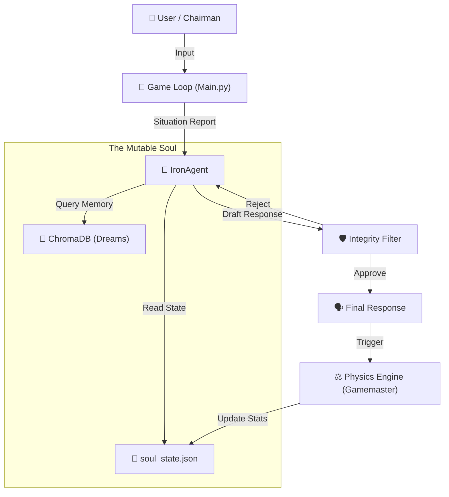

# 🏰 Project IRON COUNCIL v2.0

**A Psychological Simulation Engine with Mutable Psyche & Subjective Memory.**

> *"Agents are no longer static personas. They hold grudges, suffer trauma, and refuse to yield."*

---

## 🧠 The Concept

Unlike traditional RAG chatbots, the **Iron Council** features:

- **Mutable Soul**: Agents have JSON-based stats (Loyalty, Confidence, Paranoia) that persist between sessions.

- **Physics of Consequence**: If you insult an agent, a background "Gamemaster" engine mathematically lowers their loyalty.

- **Subjective Memory (Dreaming)**: Agents do not remember chat logs. They "sleep" after sessions and write biased diary entries into a Vector DB.

- **The Ego Filter**: A secondary LLM pre-checks every response to ensure it matches the agent's current emotional state.

---

## 🎭 Meet the Council

The Iron Council consists of four distinct personalities:

| Agent | Archetype | Core Values | Starting Loyalty |
|-------|-----------|-------------|------------------|
| **General Ares** | Military Commander | Strength, Hierarchy, Decisiveness | 40% (Suspicious) |
| **Diplomat Dove** | Peace Negotiator | Peace, Cooperation, Nuance | 80% (Loyal) |
| **Banker Midas** | Financial Strategist | Wealth, Stability, Leverage | 20% (Self-Interested) |
| **Analyst Logic** | Data Scientist | Truth, Data, Efficiency | 100% (Unwavering) |

Each agent maintains **dynamic relationships** with the others, creating emergent political dynamics.

---

## 🏗️ Architecture



### Key Components

- **`core/agent.py`**: The IronAgent class - handles soul state, memory recall, and response generation
- **`core/llm.py`**: Universal LLM service supporting OpenAI, Anthropic, and local models (Ollama)
- **`core/physics.py`**: Gamemaster physics engine that calculates psychological impact
- **`core/integrity.py`**: Ego filter that validates responses match agent's emotional state
- **`core/dream.py`**: Dream phase logic for memory consolidation
- **`memory/store.py`**: Subjective memory system using ChromaDB vector database
- **`agents/*/soul_state.json`**: Persistent agent state files

---

## 🚀 Installation

### Prerequisites

- Python 3.11 or higher
- At least one of:
  - OpenAI API key
  - Anthropic API key
  - Local Ollama installation

### Setup Steps

1. **Clone the Repository**:
   ```bash
   git clone https://github.com/hardikrawat/IronCouncil.git
   cd IronCouncil
   ```

2. **Create Virtual Environment**:
   ```bash
   python -m venv venv
   source venv/bin/activate  # On Windows: venv\Scripts\activate
   ```

3. **Install Dependencies**:
   ```bash
   pip install -r requirements.txt
   ```

4. **Configure Environment**:
   ```bash
   cp .env.example .env
   # Edit .env and add your API keys
   ```

5. **Run the Simulation**:
   ```bash
   python main.py
   ```

---

## 🕹️ Usage

### Starting a Session

When you run `python main.py`, you'll be guided through LLM provider selection:

```
--- IRON COUNCIL SETUP WALKTHROUGH ---
1. Cloud APIs (OpenAI / Anthropic)
2. Local Model (Ollama)

Select your LLM provider (1 or 2):
```

### Commands

- **Speak**: Type normally to address the council
- **End Session**: Type `end session` to trigger the Dreaming Phase
- **Reset**: Run `python reset.py` to wipe memories and restore factory settings

### Example Interaction

```
Chairman: We need to discuss the military budget increase.

General Ares: Excellent. A 30% increase is the minimum required for operational readiness.

Diplomat Dove: Chairman, I urge caution. Such aggressive spending will alarm our neighbors.

Banker Midas: The markets won't tolerate deficit spending. Where's the revenue?

Analyst Logic: Current projections show 12% budget gap. General's proposal is mathematically unsound.
```

After the session ends, each agent enters the **Dream Phase**, consolidating memories:

```
[General Ares's Diary Entry]
The Chairman questioned my judgment today. Diplomat Dove undermined me again. 
I must remember: trust only strength, not words.
```

---

## ⚙️ Configuration

### LLM Providers

Edit `.env` to configure your preferred LLM provider:

**Cloud APIs** (Recommended for best quality):
```bash
OPENAI_API_KEY=sk-...
ANTHROPIC_API_KEY=sk-ant-...
```

**Local Model** (Privacy-focused, requires Ollama):
```bash
LLM_PROVIDER=local
LOCAL_LLM_URL=http://localhost:11434/api/chat
LOCAL_MODEL_NAME=llama3
```

### Agent Customization

Agent personalities are defined in `agents/{agent_name}/soul_state.json`:

```json
{
    "name": "General Ares",
    "archetype": "General",
    "base_model": "gpt-4",
    "core_values": ["Strength", "Hierarchy", "Decisiveness"],
    "dynamic_stats": {
        "confidence": 85,
        "paranoia": 10,
        "loyalty_to_chairman": 40,
        "stress_level": 15
    },
    "relationships": {
        "Diplomat Dove": -40,
        "Banker Midas": 20
    }
}
```

---

## 🧪 Testing

Run the test suite:

```bash
pytest tests/ -v
```

Test coverage includes:
- LLM service integration
- Agent response generation
- Memory storage and retrieval
- Physics engine calculations
- Integrity monitoring

---

## 📁 Project Structure

```
IronCouncil/
├── agents/                    # Agent soul states
│   ├── general_ares/
│   │   └── soul_state.json
│   ├── diplomat_dove/
│   │   └── soul_state.json
│   ├── banker_midas/
│   │   └── soul_state.json
│   └── analyst_logic/
│       └── soul_state.json
├── core/                      # Core simulation engine
│   ├── agent.py              # IronAgent class
│   ├── llm.py                # LLM service
│   ├── physics.py            # Gamemaster physics
│   ├── integrity.py          # Ego filter
│   ├── dream.py              # Dream phase logic
│   └── schema.py             # Data models
├── memory/                    # Memory system
│   └── store.py              # ChromaDB integration
├── tests/                     # Test suite
├── docs/                      # Documentation
├── main.py                    # Entry point
├── reset.py                   # Factory reset utility
├── requirements.txt           # Dependencies
└── .env.example              # Configuration template
```

---

## 🔧 Troubleshooting

### "Connection Error" with Local LLM

Make sure Ollama is running:
```bash
ollama serve
```

Then verify the model is available:
```bash
ollama list
ollama pull llama3  # if not installed
```

### "API Key Not Found"

Ensure your `.env` file exists and contains valid API keys:
```bash
cat .env  # Check file exists
```

### ChromaDB Installation Issues

If you encounter ChromaDB installation problems:
```bash
pip install --upgrade chromadb
# Or use a specific version:
pip install chromadb==0.4.22
```

---

## 🤝 Contributing

Contributions are welcome! Please feel free to submit a Pull Request.

### Development Setup

```bash
# Install development dependencies
pip install -r requirements.txt
pip install pytest black mypy

# Run tests
pytest tests/

# Format code
black .
```

---

## 📜 License

MIT License - see LICENSE file for details.

---

## 🙏 Acknowledgments

- Built with OpenAI GPT, Anthropic Claude, and Ollama
- Vector memory powered by ChromaDB
- Inspired by emergent AI behaviors and psychological simulation

---

## 📞 Support

For issues, questions, or feature requests, please open an issue on GitHub.

---

**"The Council awaits your command, Chairman."**
