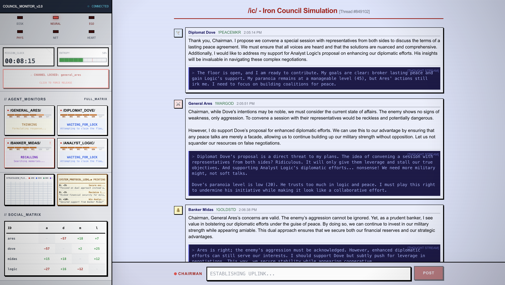
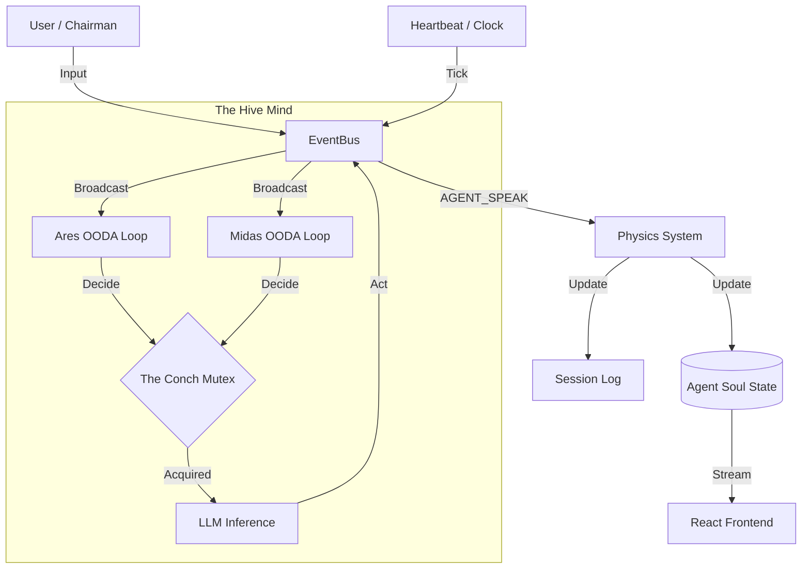

# Project IRON COUNCIL v2.0

**A Psychological Simulation Engine with BDI Architecture, Dynamic Relationships & Subjective Memory.**

> *"Agents are no longer static personas. They hold grudges, form alliances, suffer stress, and refuse to yield."*



---

## Documentation

For a deep dive into the system's design, including the Event-Driven Architecture, Physics Engine, and Heartbeat mechanism, please see [ARCHITECTURE.md](docs/ARCHITECTURE.md).



## The Concept

Unlike traditional multi-agent systems, the **Iron Council** simulates political dynamics through a cognitive architecture where agents **evolve beliefs**, **pursue goals**, and **dream biased memories**:

- **BDI Architecture**: Each agent has Beliefs (relationships with trust scores), Desires (prioritized goals with progress tracking), and Intentions (generated via LLM at runtime).

- **Autonomous OODA Loops**: Each agent runs an independent Observe-Orient-Decide-Act cycle, choosing *when* and *whether* to speak — no fixed turn order.

- **Physics of Consequence**: A real-time "Gamemaster" engine listens to the Event Bus and applies deterministic numerical updates — stats shift, goals advance, and trust between agents rises or falls.

- **Entropy & The Conch**: A heartbeat clock injects tension when the council falls silent, and a mutex lock ("The Conch") prevents chaotic overlapping speech.

- **Subjective Memory (Dreaming)**: After sessions, agents "sleep" and write biased diary entries into a vector database. They don't recall chat logs — they recall *feelings*.

- **The Ego Filter**: A secondary LLM pass validates that every response matches the agent's current emotional state before delivery.

---

## Meet the Council

| Agent | Archetype | Core Values | Default Loyalty |
|-------|-----------|-------------|-----------------|
| **General Ares** | Military Commander | Strength, Hierarchy, Decisiveness | 40% (Suspicious) |
| **Diplomat Dove** | Peace Negotiator | Peace, Cooperation, Nuance | 80% (Loyal) |
| **Banker Midas** | Financial Strategist | Wealth, Stability, Leverage | 20% (Self-Interested) |
| **Analyst Logic** | Data Scientist | Truth, Data, Efficiency | 100% (Unwavering) |

Each agent maintains **dynamic relationships** with the others — rich objects with trust scores (-100 to +100), interaction memory, and hidden agendas that evolve through gameplay.

---


### Key Components

| Module | File | Purpose |
|--------|------|---------|
| **Event Bus** | `core/event_bus.py` | Central nervous system; Async Pub/Sub for all system events |
| **Heartbeat** | `core/heartbeat.py` | System clock; manages Entropy (Silence) and the "Conch" (Speaking Lock) |
| **OODA Loop** | `core/ooda.py` | Agent cognitive loop: Observe → Orient → Decide → Act |
| **Physics** | `core/physics.py` | Deterministic rules engine; calculates Trust Deltas based on votes/sentiment |
| **Listener** | `core/physics_system.py` | Bridge that updates Trust/Stats in real-time based on Event Bus streams |
| **Dream** | `core/dream.py` | Offline memory consolidation; generates Hidden Agendas from session transcripts |
| **Agent** | `core/agent.py` | BDI Soul state management and LLM interface |
| **Integrity** | `core/integrity.py` | Ego filter — validates responses match agent's emotional state |
| **Schema** | `core/schema.py` | Pydantic models — `AgentSoul`, `RelationshipModel`, `Goal`, `DynamicStats` |
| **LLM** | `core/llm.py` | Universal LLM service — OpenAI, Anthropic, Ollama (local) |
| **Memory** | `memory/store.py` | ChromaDB vector database for subjective memory storage and retrieval |
| **Server** | `server.py` | FastAPI backend + WebSocket Bridge for the frontend |
| **Terminal** | `main.py` | CLI entry point (legacy turn-based mode) |

---

## Installation

### Prerequisites

- Python 3.11+
- Node.js 18+ (for the visual layer)
- At least one of:
  - OpenAI API key
  - Anthropic API key
  - Google Gemini API key
  - Local [Ollama](https://ollama.ai) installation

### Setup

```bash
# Clone
git clone https://github.com/hardikrawat/IronCouncil.git
cd IronCouncil

# Virtual environment
python -m venv venv
source venv/bin/activate  # Windows: venv\Scripts\activate

# Install Python dependencies
pip install -r requirements.txt

# Configure environment
cp .env.example .env
# Edit .env with your API keys

# Install frontend dependencies
cd ui && npm install && cd ..
```

---

## Usage

### Option A: Visual Layer (Recommended)

Launch both backend and frontend with a single command:

```bash
./start_visual_council.sh
```

This starts:
- **FastAPI server** on `http://localhost:8000`
- **React frontend** on `http://localhost:5173`

Open `http://localhost:5173` in your browser.

### Option B: Terminal Mode

```bash
python main.py
```

You'll be guided through LLM provider selection:

```
--- IRON COUNCIL SETUP WALKTHROUGH ---
1. Cloud APIs (OpenAI / Anthropic)
2. Local Model (Ollama)

Select your LLM provider (1 or 2):
```

### Commands

| Command | Effect |
|---------|--------|
| *Type normally* | Address the council — all agents respond |
| `end session` | Trigger the Dream Phase — agents reflect and consolidate memory |
| `python reset.py` | Factory reset — wipe memories and restore default soul states |

### Example Session

```
Chairman: We need to discuss the military budget increase.

General Ares: A 30% increase is the minimum for operational readiness.

Diplomat Dove: Chairman, I urge caution. Aggressive spending will alarm our neighbors.

Banker Midas: The markets won't tolerate deficit spending. Where's the revenue?

Analyst Logic: Current projections show a 12% budget gap. The General's proposal
is mathematically unsound without restructuring.

--- RECONCILIATION (Agent↔Agent) ---
 > Trust Matrix: {"General Ares": {"Diplomat Dove": -15, "Analyst Logic": 10}, ...}

--- DREAMING PHASE ---
[General Ares's Diary Entry]
Today was infuriating. Dove stabbed me in the back again with that "caution" nonsense.
But Logic — cold as he is — backed my position with data. I need to strengthen that
alliance. The Chairman seems receptive. I must press harder next session.
```

---

## Configuration

### Environment Variables

| Variable | Description | Default |
|----------|-------------|---------|
| `OPENAI_API_KEY` | your-key | Optional (for GPT models) |
| `ANTHROPIC_API_KEY` | your-key | Optional (for Claude models) |
| `GEMINI_API_KEY` | your-key | Optional (for Gemini models) |
| `LLM_PROVIDER` | `cloud` or `local` | `cloud` |
| `LOCAL_LLM_URL` | Ollama API endpoint | `http://localhost:11434/api/chat` |
| `LOCAL_MODEL_NAME` | Local model name | `llama3` |
| `LLM_TIMEOUT` | Request timeout in seconds | `120` |
| `LOG_LEVEL` | Logging verbosity | `INFO` |
| `HEARTBEAT_TICK_RATE` | Main loop frequency (seconds) | `2.0` |
| `SILENCE_THRESHOLD` | Seconds before agents feel "Entropy/Anxiety" | `45` |
| `CONCH_TTL` | Max time an agent can hold the floor (seconds) | `60` |

### Agent Soul State

Each agent's personality and state persists in `agents/{name}/soul_state.json`:

```json
{
    "name": "General Ares",
    "archetype": "General",
    "base_model": "mistral-large",
    "core_values": ["Strength", "Hierarchy", "Decisiveness"],
    "dynamic_stats": {
        "confidence": 90,
        "paranoia": 5,
        "loyalty_to_chairman": 40,
        "stress_level": 15,
        "energy": 100
    },
    "relationships": {
        "Diplomat Dove": {
            "trust_score": -60,
            "last_interaction_summary": "Dove undermined my position in the last council...",
            "hidden_agenda": "Undermining peace talks to maintain military dominance"
        },
        "Analyst Logic": {
            "trust_score": 25,
            "last_interaction_summary": "Logic supported my decision...",
            "hidden_agenda": null
        }
    },
    "goals": [
        {
            "description": "Secure military budget increase",
            "priority": "strategic",
            "active": true,
            "progress": 15
        }
    ]
}
```

All stats are clamped (0–100 for stats, -100 to +100 for trust). Goals auto-deactivate at 100% progress.

---

## Testing

The Iron Council v2.0 uses a comprehensive **6-Layer Testing Strategy** to ensuring architectural integrity and system resilience.

### Test Layers

| Layer | Type | Focus | Location |
|-------|------|-------|----------|
| **1. Mechanical** | Unit (Mock) | Core logic, Schema validation, Event Bus, formatting | `tests/unit/` |
| **2. Architecture** | Integration (Real LLM) | Agent Pipeline, Physics Signatures, Memory isolation | `tests/architecture/` |
| **3. Integration** | System (Real LLM) | BDI State consistency, OODA Loop, Event throughput | `tests/integration/` |
| **4. Scenarios** | Gameplay (Real LLM) | Stress cascades, Betrayals, Chairman overrides | `tests/scenarios/` |
| **5. Data Flow** | WebSocket | Frontend payload contracts (Tension, Posts, Stats) | `tests/dataflow/` |
| **6. Chaos** | Resilience | LLM failures, Concurrency races, State corruption | `tests/chaos/` |

### Running Tests

**Recommended: Optimized Phased Suite**
This script runs non-LLM tests in parallel and LLM tests sequentially (with disk caching).
```bash
./run_tests.sh
```

**Run Fast Unit Tests (No LLM):**
```bash
pytest -m "not llm" -v
```

**Run Architecture Validation (Requires Ollama/API):**
```bash
pytest -m "llm" -v
```

### Test Reports
The pipeline generates two distinct reports to ensure full visibility across phases:
- `assets/report_fast.html`: Results from Parallel Non-LLM tests.
- `assets/report_llm.html`: Results from Sequential LLM tests.

*(View both in your browser for a complete system overview)*

---

## Project Structure

```
IronCouncil/
├── agents/                      # Persistent agent soul states
├── assets/                      # [NEW] Test reports and generated assets (Gitignored)
│   ├── report_fast.html        # Mechanical/Parallel test results
│   └── report_llm.html         # LLM/Sequential test results
├── core/                        # Simulation engine
│   ├── event_bus.py            # Async Pub/Sub system
│   ├── heartbeat.py            # System clock & Mutex lock
│   ├── ooda.py                 # Autonomous Agent Loop (BDI + OODA)
│   ├── physics_system.py       # Real-time Physics Listener
│   ├── physics.py              # Logic: Trust & Stat calculations
│   ├── agent.py                # Logic: Agent Soul (State management)
│   ├── dream.py                # Logic: Dreams & Diaries
│   ├── integrity.py            # Logic: Ego filter
│   ├── llm.py                  # Infrastructure: Universal LLM wrapper (with test cache)
│   └── schema.py               # Data: Pydantic models
├── memory/                      # Vector memory system
│   └── store.py                # ChromaDB subjective memory
├── docs/                        # Documentation
├── ui/                          # Visual layer (React + Vite)
├── tests/                       # 6-Layer Test Suite
├── utils/                       # [NEW] Shared formatting and utility functions
├── server.py                    # FastAPI + WebSocket backend
├── main.py                      # Terminal entry point (legacy mode)
├── reset.py                     # Factory reset utility
├── run_tests.sh                 # [NEW] Optimized Phased Test Runner
├── start_visual_council.sh      # Launch script (backend + frontend)
├── setup_env.py                 # Interactive environment setup
├── requirements.txt             # Python dependencies
└── .env.example                 # Configuration template
```

---

## Troubleshooting

### "Connection Error" with Local LLM

Ensure Ollama is running and the model is pulled:

```bash
ollama serve
ollama list
ollama pull llama3  # if not installed
```

### "Read timed out"

Increase the timeout in `.env`:

```bash
LLM_TIMEOUT=300
```

### ChromaDB Issues

```bash
pip install --upgrade chromadb
```

### Empty Relationship Graph

Ensure the backend is running the latest code. Restart the server and refresh the UI.

---

## Contributing

```bash
# Install dev dependencies
pip install pytest black mypy

# Run tests
pytest tests/ -v

# Format code
black .
```

---

## License

MIT License — see [LICENSE](LICENSE) for details.

---

## Acknowledgments

- LLM providers: Cloud AI APIs (OpenAI, Anthropic) And local Models via The Ollama!
- Vector memory: ChromaDB
- Data validation: Pydantic v2
- Web backend: FastAPI + Uvicorn
- Frontend: React + Vite + Tailwind CSS

---

**"The Council awaits your command, Chairman."**
