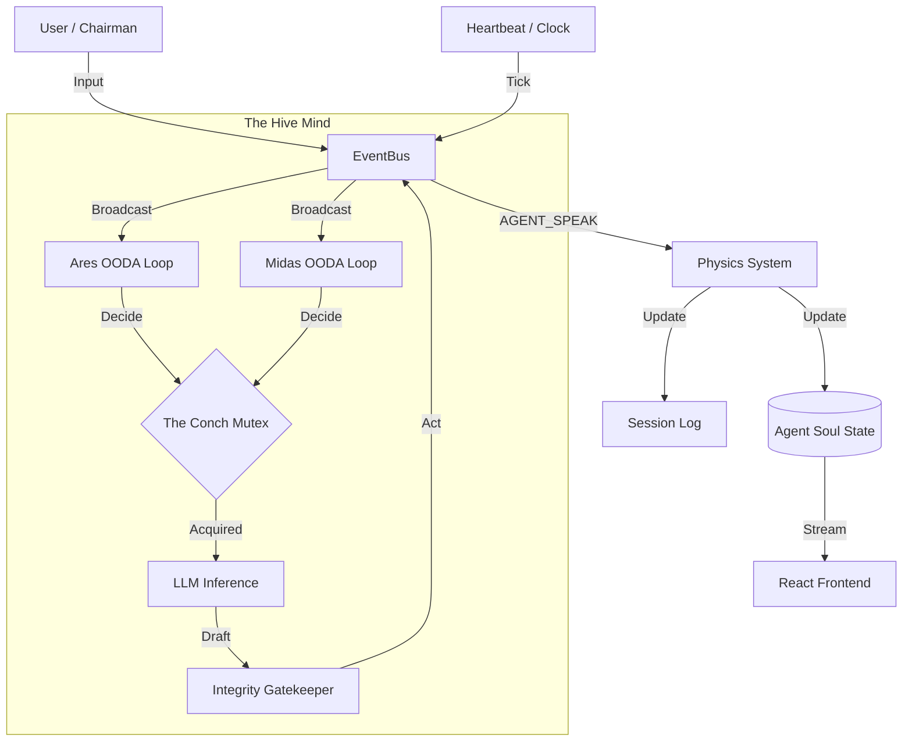

# Iron Council v2.0 Architecture

## Overview
Iron Council is an autonomous multi-agent simulation where AI agents ("The Council") govern a fictional state in real-time. The system has evolved from a turn-based terminal application to a real-time, event-driven web application.

## Core Architecture: The Event-Driven Loop

### 1. The Event Bus
The central nervous system of the application (`core/event_bus.py`). It decouples components, allowing agents to react to the world without direct dependencies on the source.
- **WORLD_EVENT**: Inputs from the Chairman (User) or system alerts.
- **AGENT_SPEAK**: Public statements made by council members.
- **SYSTEM_TICK**: Regular heartbeat pulses to keep the simulation alive.

### 2. The OODA Loop
Each agent runs an infinite `Observe-Orient-Decide-Act` loop (`core/ooda.py`).
- **Observe**: Listens to the Event Bus for recent context.
- **Orient**: Checks internal state (Energy, Stress, Paranoia).
- **Decide**: Uses the **Heartbeat Conch** to ensure only one agent speaks at a time.
- **Act**: Generates a response via LLM, validates it through the **Integrity Gatekeeper (Ego Filter)**, and publishes it back to the bus.

### 2.1 The Integrity Gatekeeper
The final checkpoint before speech (`core/integrity.py`). It uses a fast LLM pass to ensure an agent's response hasn't "drifted" from their core values or current emotional state (e.g., an arrogant agent should not apologize).

### 3. The Heartbeat & Entropy
The `Heartbeat` (`core/heartbeat.py`) manages the simulation's tempo.
- **Entropy (Silence)**: If no one speaks for 45s, `Global Tension` rises, forcing agents to react to the silence.
- **Conch TTL**: The lock has a 180-second TTL to ensure agents have enough time for complex generations while preventing deadlocks.

### 4. The Physics Engine
The "Law of Consequences" (`core/physics.py` & `core/physics_system.py`).
- **Determinism**: Unlike standard LLM chat, the Physics Engine applies explicit numerical updates to agent states.
- **User Impact**: When the Chairman speaks, every agent's `Confidence`, `Paranoia`, and `Loyalty` are updated based on the content.
- **Agent Dynamics**: When an agent speaks, the engine calculates how it affects the trust of *every other agent* listening.
- **Guardrails**:
    - **Reaction Spiral Prevention**: Physics updates *only* change internal state. They never trigger an immediate output, preventing infinite loops.
    - **Transcript Safety**: The Physics System maintains the canonical session log used for dreaming.

## Data Persistence: The Soul
Agents are persistent entities (`core/schema.py`). Their state is saved to `agents/<name>/soul_state.json` after every interaction.
- **Core Values**: Immutable beliefs (e.g., "War is necessary").
- **Dynamic Stats**: Mutable values (0-100) like `Energy`, `Stress`.
- **Relationships**: A directed graph of trust scores (-100 to 100) between agents.

## Memory Systems
The Iron Council uses a dual-memory approach:
1. **Short-Term Memory**: The `EventBuffer` (`core/ooda.py`) stores the last 50 events for immediate OODA context.
2. **Subjective Memory (ChromaDB)**: A vector database (`memory/store.py`) where agents store and recall "feelings" and "observations" via semantic search.

## Dreaming
At the end of a session, agents enter the **Dream Phase** (`core/dream.py`).
- They review the **Session Transcript**.
- They analyze their **Trust Deltas** (who helped/hurt them).
- They write a subjective **Diary Entry**.
- **Stat Osmosis**: The simulation applies permanent stat updates and relationship shifts based on the "emotional residue" of the dream.
- They form **Hidden Agendas** against enemies.
