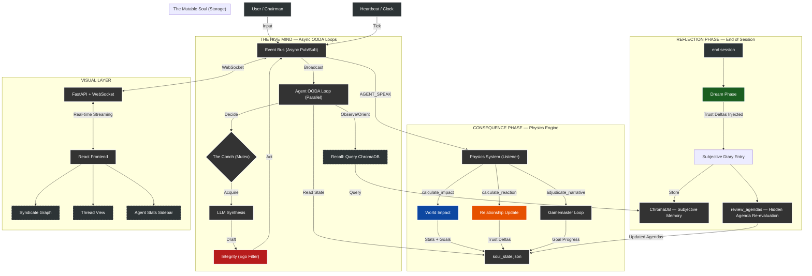

# Iron Council v2.0 Architecture (Revised)

## 1. System Overview
Iron Council v2.0 is a **real-time, asynchronous, event-driven multi-agent simulation**. Unlike turn-based chatbots, agents operate in parallel execution loops, synchronized by a central heartbeat and a rigorous "Physics Gating" protocol to ensure emotional causality (agents must "feel" an event before they can "react" to it).

The system is built on **FastAPI** (WebSockets) for the frontend bridge and a custom **Python EventBus** for internal agent orchestration.

---

## 2. Core Architecture: The Asynchronous Loop

The system does not run in a linear circle. It runs as independent services communicating via the `EventBus`.

---

## 2.1 Core Principle: Subjective Reality ("The 'I' Shift")

In traditional multi-agent systems, agents read a "God View" transcript (e.g., `Ares: Hello. Dove: Hi.`). This causes "Identity Drift" because the model forgets who it is. 

Iron Council v2.0 implements **Subjective Reality**:
1.  **The Filter:** The Global Event Bus is the "Objective Reality".
2.  **The Shift:** Before an agent perceives an event, the system rewrites the transcript from their perspective.
    *   **Objective:** `General Ares: Attack!`
    *   **Ares Sees:** `YOU: Attack!`
    *   **Dove Sees:** `General Ares: Attack!`
3.  **Result:** The LLM is forced into a first-person ego-centric perspective, preventing it from accidentally speaking for other agents or hallucinating identities. This logic is handled in the `OODALoop` before the prompt is constructed.

---

## 3. The Central Nervous System (`core/event_bus.py`)
The application is entirely decoupled. Components do not call each other; they publish events.

### Key Event Types
1.  **WORLD_EVENT**: Inputs from the User/Chairman.
2.  **AGENT_SPEAK**: Public dialogue from an agent.
3.  **PHYSICS_SYNC / PHYSICS_COMPLETE**: *Critical control signals* that tell agents when the emotional impact of an event has been calculated.
4.  **SILENCE_WARNING**: Generated by the Heartbeat when entropy rises.
5.  **SYSTEM_TICK**: The metronome (2.0s interval) keeping loops alive.

---

## 4. The Agent OODA Loop (`core/ooda.py`)
Agents are not request-response handlers. They are infinite loops running `Observe-Orient-Decide-Act` cycles.

### 4.1 The Physics Gate (Reaction Gating)
A critical feature found in `ooda.py` is the **Reaction Gate**.
* **The Problem:** In async systems, an agent might reply to a message before the "Physics Engine" has calculated how that message hurt their feelings.
* **The Solution:**
    1.  When `ooda.py` sees a `WORLD_EVENT` or `AGENT_SPEAK`, it enters a `waiting_for_physics` state.
    2.  It pauses the agent's ability to speak.
    3.  It waits for a specific `PHYSICS_COMPLETE` or `RELATIONSHIP_UPDATE` event from the Physics System.
    4.  Only *after* the stats are updated does the agent proceed to `DECIDE`, ensuring the response reflects the new emotional state.

### 4.2 The Decision Trigger
Agents use a "Thrifty" decision model. They do not query the LLM every tick.
* **Triggers:** New World Events, specific Peer Speech (70% probability), or High Tension (Entropy > 50%).
* **Impulse:** A small (5%) random chance to speak spontaneously.

---

## 5. The Physics System (`core/physics_system.py`)
The Physics System is a standalone service that acts as the "Law of Consequences." It has two distinct layers:

### Layer 1: Immediate Reaction (The "Hot" Path)
When an event occurs, the Physics System calculates impacts **in parallel** (using `asyncio.gather`) for all agents to minimize latency.
* **User Input:** Updates `Confidence`, `Paranoia`, `Loyalty`, `Stress`.
* **Agent Input:** Updates `Trust` scores between the speaker and *every* listener.
* **Output:** Updates the `AgentSoul` in memory and emits `AGENT_STATUS` updates to the UI.

### Layer 2: The Gamemaster Loop (The "Cold" Path)
Defined in `GamemasterPhysics`, this processes the narrative arc.
* **Buffering:** It collects a buffer of ~3 messages.
* **Adjudication:** It asks a higher-intelligence LLM to judge if **Goals** (e.g., "Start a War") have advanced or regressed.
* **Verdict:** It emits `NARRATIVE_VERDICT` events, which serve as the "Ledger of Truth" for the simulation.

---

## 6. Concurrency & The Heartbeat (`core/heartbeat.py`)
The simulation uses strict locking to prevent chaos.

* **The Conch (Async Mutex):**
    * Only one agent can speak at a time.
    * Implemented via `asyncio.Lock` to prevent **TOCTOU** (Time-Of-Check to Time-Of-Use) race conditions where two agents think they grabbed the mic simultaneously.
    * **TTL (Time To Live):** 180 seconds. If an agent hoards the conch (e.g., LLM hangs), the Heartbeat forcibly revokes it.

* **Entropy (Tension):**
    * If no activity is detected for 45s, `Global Tension` rises.
    * High tension triggers paranoia-based responses in agents via the OODA loop.

---

## 7. Data Persistence & Memory (`core/schema.py` & `memory/store.py`)

### The Soul File (`soul_state.json`)
Persistence is atomic.
* **Core Values:** Immutable beliefs.
* **Dynamic Stats:** Mutable (0-100) stats like Energy and Stress.
* **Relationships:** A Directed Graph of trust.
* **Goals:** BDI (Belief-Desire-Intention) structures with 0-100% progress bars.

### Memory Systems
1.  **Short-Term (Context):** The last 50 events in the `EventBuffer` (RAM).
2.  **Subjective Long-Term (ChromaDB):**
    * Agents store "Feelings" and "Observations" in a vector database.
    * Before speaking, they query ChromaDB for context relevant to the current situation.

---

## 8. The Dream Phase (`core/dream.py`)
The simulation includes a sophisticated shutdown sequence called the **Dream Phase**.

1.  **The Drain:** The server pauses the Heartbeat and waits for all in-flight OODA cycles to complete (`wait_for_drain`).
2.  **Dreaming:** Agents stream a monologue reviewing the session transcript.
3.  **Stat Osmosis:** The *emotional residue* of the dream permanently alters their baseline stats for the next session.
4.  **Agenda Review:** Agents generate "Hidden Agendas" (Secret Goals) against enemies who betrayed them during the session.

---

## 9. Infrastructure (`server.py`)

### The WebSocket Bridge
Connecting the Python EventBus to the React Frontend:
* Subscribes to `AGENT_SPEAK`, `AGENT_STATUS`, and `SYSTEM_TICK`.
* Broadcasts JSON payloads to connected WebSocket clients.
* Handles "Initial Sync" for late-joining clients.

### TUI Monitor (Terminal User Interface)
A production-grade CLI dashboard running in a separate thread.
* Uses ANSI escape codes to render a live status header (Uptime, Tension, Conch Owner).
* Scrolls logs in a protected viewport below the header.